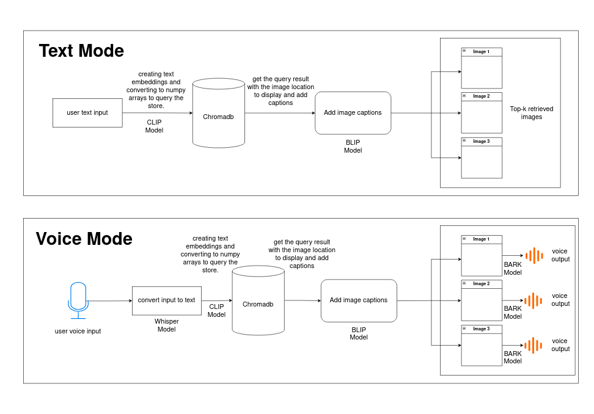

# Multi-modal Image Retrieval System (MMIRS) App

## Description  
An image retrieval system that takes in a user query in text/voice format and retrieves top images that match the user's request. The output are top three images with captions and also an option to get a voice output describing the images returned. All the models used are open source.

## Table of Contents
- [Approach](#approach)
- [Installation](#installation)
- [Testing](#testing)
- [Usage](#usage)
- [Deployment](#deployment)

## Approach



## Installation  

### Prerequisites  
- Python 3.9+  
- pip or conda  
- (Optional) Virtual environment (recommended)  

### Steps  
1. **Clone the repository**  
   ```sh  
   git clone https://github.com/fisokuhle21/multi-modal_image_retrieval_system.git  
   cd multi-modal_image_retrieval_system 

2. **(Optional) Create a virtual environment**
    ```sh
    python -m venv venv  
    source venv/bin/activate  # macOS/Linux  
    venv\Scripts\activate  # Windows  

3. **Install dependencies**
    ```sh
    pip install -r requirements.txt

## Testing
1. **Test that the app loads and runs successfully without errors**
    ```sh
    pytest tests/test_home.py

2. **Test that all the important chat elements are there**
    ```sh
    pytest tests/test_elements.py

## Usage
1. **(If running for the first time) Add the image data to Chromadb collection and data**
    - call ```run_text_to_image()``` in ```shared/functions.py``` with the variables ```create_collection``` and ```add_data``` set to True
2. **Run the Streamlit app locally:**
    ```sh
    streamlit run app.py
    ```

## Deployment
1. (Optional) Upload the session data to persistant data store to avoid the data being cleared on reload. 

2. Push your code to Github.

3. Set up a CI/CD workflow using github actions or codepipeline (AWS)

4. Deploy on the Streamlit Cloud for free (no need for step 3) or on a Server
